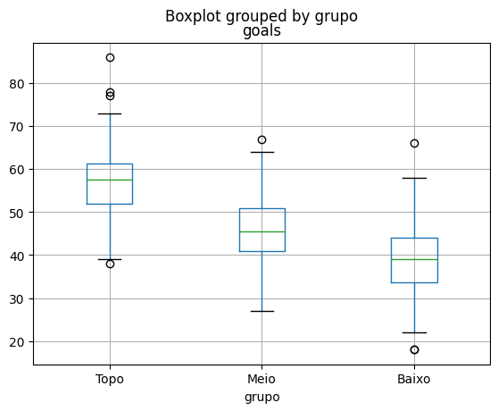
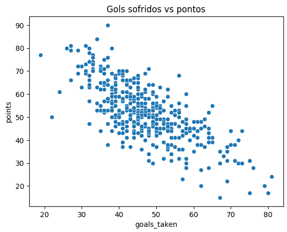
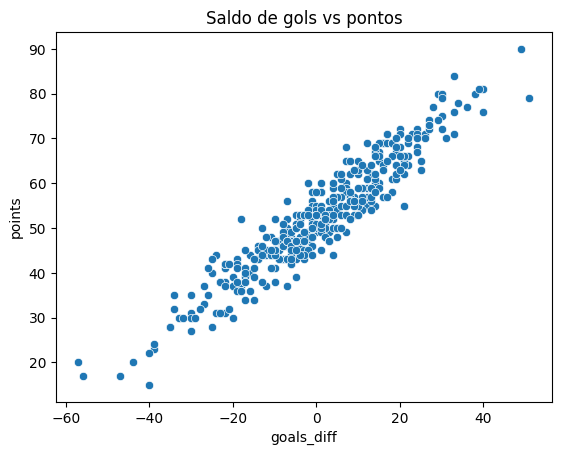
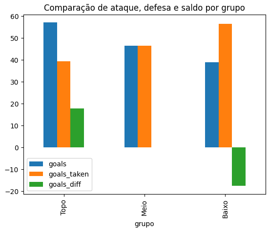

# 📊 Análise de Desempenho do Brasileirão

Este é um projeto de análise exploratória e estatística sobre o Campeonato Brasileiro,
com foco em identificar quais métricas mais influenciam a posição final dos clubes na tabela.

O estudo investiga a relação entre ataque, defesa e saldo de gols, para responder a seguinte pergunta:

> Quais características estatísticas melhor explicam o desempenho de uma equipe no Brasileirão?

---

## Estrutura do Projeto

```bash
brazilian_league_performance_analysis/
│
├── data/
│   └── dataset.csv
│
├── images/
│   ├── barplot_final_comparison.png
│   ├── boxplot_goals_by_group.png
│   ├── goal_difference_vs_points.png
│   └── goals_taken_vs_points.png
│
├── notebooks/
│   └── performance_analysis.ipynb
│
├── README.md
└── requirements.txt
```

---

## Tecnologias Utilizadas

* Python 3
* Pandas
* Matplotlib
* Seaborn
* Jupyter Notebook

---

## Metodologia

### Fonte

Foi utilizada uma base de dados histórica contendo o desempenho final de clubes no Campeonato Brasileiro Série A entre 2003 e 2025, incluindo métricas agregadas de temporada como pontos, vitórias, gols marcados e gols sofridos.

---

### Análise Exploratória Inicial

Antes da análise principal, foi realizada uma análise exploratória para compreender a estrutura e a qualidade dos dados, incluindo:

* Verificação de tipos e estrutura das variáveis
* Análise de estatísticas descritivas
* Identificação de valores nulos
* Validação de consistência lógica dos dados, como:

  * Pontuação máxima possível por número de partidas
  * Quantidade de vitórias, empates e derrotas compatível com jogos disputados

---

### Padronização das Temporadas

Foi identificado que algumas temporadas históricas possuem diferentes quantidades de partidas por equipe, o que compromete a comparabilidade de estatísticas acumuladas entre anos.

Para garantir consistência metodológica:

* Foram selecionadas apenas temporadas em que todas as equipes disputaram **38 partidas**
* A análise final considerou o período de **2006 a 2025** *(20 anos)*

---

### Feature Engineering

Foram criadas métricas derivadas para enriquecer a análise:

* **Média de gols por jogo**
* **Média de gols sofridos por jogo**

Além disso, os clubes foram segmentados em grupos de desempenho com base na colocação final:

| Grupo | Colocações |
| ----- | ---------- |
| Topo  | 1º ao 6º   |
| Meio  | 7º ao 14º  |
| Baixo | 15º ao 20º |

---

## Hipóteses Investigadas

### Hipótese 1 — Times do topo marcam significativamente mais gols?

**Resultado:** Parcialmente confirmada.

* Times melhor colocados apresentam maior média de gols marcados
* Entretanto, há sobreposição relevante entre as distribuições dos grupos
* Equipes fora do topo podem alcançar desempenho ofensivo semelhante em alguns casos



> Apesar de os times do topo apresentarem melhor desempenho ofensivo em média, a sobreposição entre grupos indica que o ataque isolado não explica completamente a classificação final.

**Conclusão:**  
O ataque contribui para melhores posições, mas isoladamente não explica de forma suficiente a separação entre os grupos da tabela.

---

### Hipótese 2 — A defesa influencia mais que o ataque?

**Resultado:** Não confirmada.

* Ataque e defesa apresentam forte relação com desempenho final
* As correlações e diferenças entre grupos são próximas
* Observa-se leve vantagem estatística para o ataque, porém insuficiente para afirmar superioridade relevante



> Observa-se forte relação inversa entre gols sofridos e pontuação, reforçando a importância defensiva no desempenho das equipes.

**Conclusão:**  
Não há evidência de que a defesa tenha maior influência que o ataque; ambos desempenham papel relevante e comparável.

---

### Hipótese 3 — O saldo de gols é um importante fator de separação?

**Resultado:** Fortemente confirmada.

* O saldo de gols separa claramente os grupos da tabela
* Apresenta baixa sobreposição estatística entre topo, meio e parte inferior
* Correlação com pontos: **0.94**



> A forte linearidade observada demonstra que o saldo de gols possui alto poder explicativo sobre a pontuação final.

**Conclusão:**  
O saldo de gols é uma métrica com grande poder explicativo sobre o desempenho final das equipes, indicando que o equilíbrio entre ataque e defesa é mais relevante do que fatores isolados.

---

## Comparativo Geral entre Grupos



> O gráfico resume visualmente a diferença de ataque, defesa e saldo de gols entre os grupos, evidenciando como o equilíbrio entre os fatores diferencia equipes de topo e de parte inferior da tabela.

---

## Limitações

* A análise considera apenas estatísticas agregadas de temporada;
* Não considera fatores externos (elenco, lesões, orçamento, influência da torcida, etc.);

---

## Conclusão Final

A análise demonstra que o sucesso no Brasileirão não pode ser explicado por desempenho ofensivo ou defensivo de forma isolada.

Embora equipes mais bem colocadas tendam a marcar mais gols e sofrer menos, o fator com maior poder explicativo sobre a classificação final é o **saldo de gols**, que sintetiza o equilíbrio entre eficiência ofensiva e solidez defensiva.

---

## Como Executar

Os comandos abaixo funcionam em Windows, Linux e macOS (com Git, Python e Jupyter instalados):

**1. Clone o repositório:**

```bash
git clone <url-do-repositorio>
```

**2. Entre no diretório**

```bash
cd brazilian-league-performance-analysis
```

**3. Instale as dependências:**

```bash
pip install -r requirements.txt
```

**4. Abra o notebook:**

```bash
jupyter notebook notebooks/performance_analysis.ipynb
```

Caso prefira, pode visualizar o notebook diretamente, abrindo-o pelo próprio repositório do Github.
